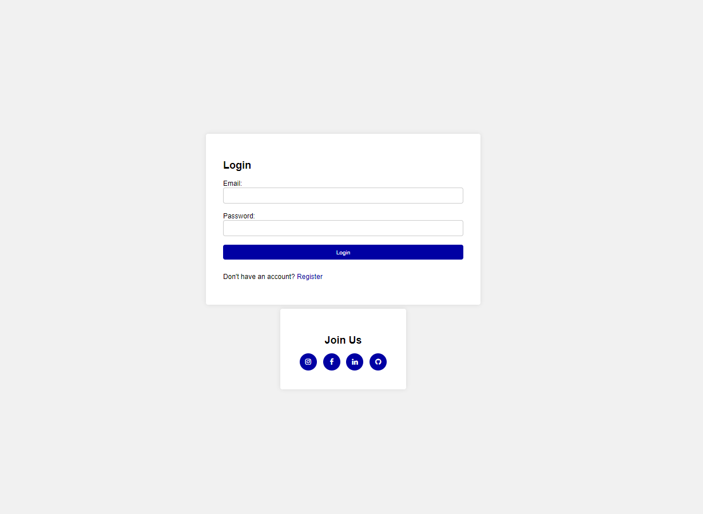
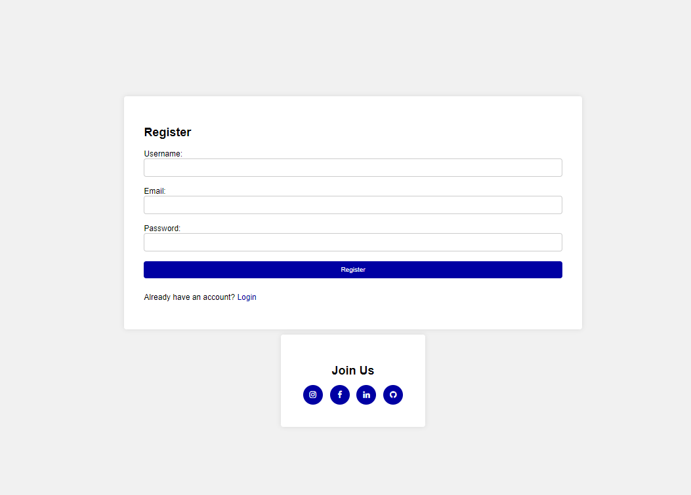

# Call App

## Description
The "Call App" is a simple online communication tool that allows users to create accounts, log in, log out, create new rooms, join existing rooms, display user lists, and check who is available.






## Features
- Registering a new account
- Logging in and logging out
- Creating new rooms
- Joining existing rooms
- Displaying user lists
- Checking who is available

## Technologies
- Java
- Spring Boot
- HTML
- CSS
- Zego Cloud (https://www.zegocloud.com/)

## Running Instructions
1. Clone the repository: `git clone <repository_url>`
2. Navigate to the project directory: `cd call-app`
3. Run the application using Maven: `mvn spring-boot:run`
4. The application will be available at: `http://localhost:8080`
5. For the application to work correctly, you need to create an account on [Zego Cloud](https://www.zegocloud.com/).
6. In the videocall.html file, replace the placeholders with your Zego Cloud credentials:
   ```javascript
   const appID = 'GENERATE_YOURS';
   const serverSecret = "GENERATE_YOURS";

## Requirements
- Java 8 or higher
- Maven
- Web browser