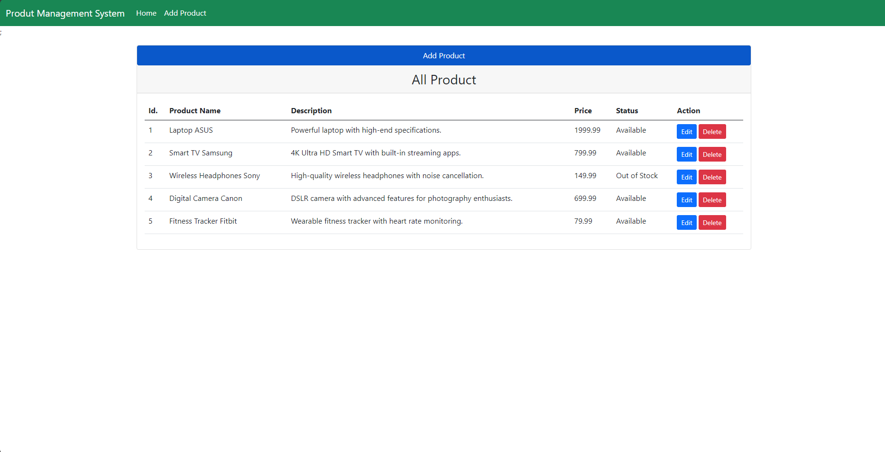
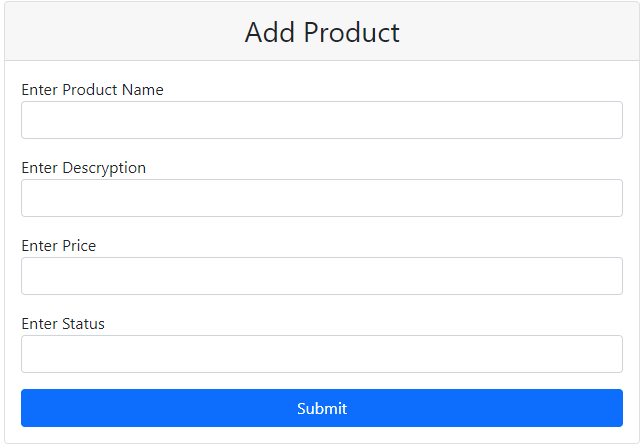
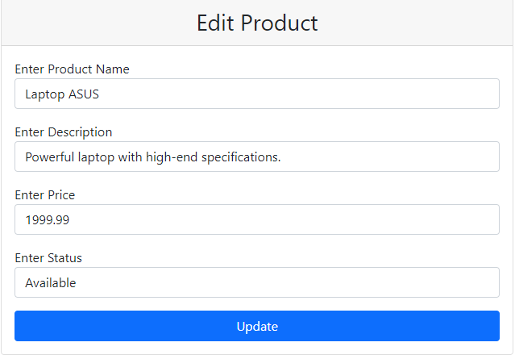
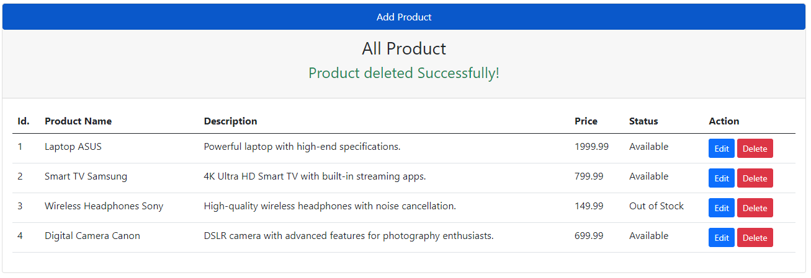

# Project Name

## Project Description

Project Name is a web application that allows users to manage a list of products. The application consists of two modules: a backend built with Java Spring Boot and MySQL, and a frontend written in React with routing.



## Features

- Add new products to the list.
- Display a list of available products.
- Remove products from the list.
- Edit product information.





## Technologies

- Backend:

  - Java Spring Boot
  - MySQL

- Frontend:
  - React
  - React Router

## Installation

### Backend (Java Spring Boot)product-management-app/product-management-back

1. Clone the repository: `git clone https://github.com/Myszczur/spring-boot-repositories/tree/main/product-management-app/product-management-back`
2. Navigate to the backend folder: `cd product-management-back`
3. Run the application: `./mvnw spring-boot:run`

### Frontend (React)

1. Clone the repository: `git clone https://github.com/Myszczur/spring-boot-repositories/tree/main/product-management-app/product-management-front`
2. Navigate to the frontend folder: `cd product-management-front`
3. Install dependencies: `npm install`
4. Run the application: `npm start`

## Database Configuration

In the `application.properties` file in the backend folder, configure the MySQL database credentials:

```properties
spring.datasource.url=jdbc:mysql://localhost:3306/your_database_name
spring.datasource.username=your_username
spring.datasource.password=your_password
```

## Resources Used

    Java Spring Boot
    React
    React Router
